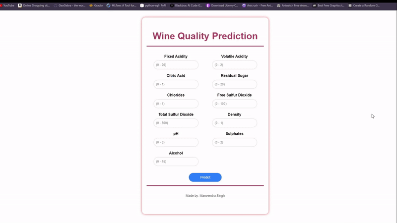

# Wine-Quality-Prediction

## Project Description
This project focuses on predicting the quality of wine samples using machine learning techniques. It involves a comprehensive data pipeline consisting of data ingestion, validation, transformation, model training, and evaluation stages.

## Data Gathering Source
The dataset used in this project is sourced from [Kaggle - Wine Quality Dataset](https://www.kaggle.com/datasets/uciml/red-wine-quality-cortez-et-al-2009). This dataset contains various attributes of wine samples, including fixed acidity, volatile acidity, citric acid, residual sugar, chlorides, free sulfur dioxide, total sulfur dioxide, density, pH, sulphates, alcohol, and quality.

## Steps in the Project

- **Data Ingestion**: The data ingestion process involves downloading the dataset and extracting it. This step ensures that the data is available for further processing.

- **Data Validation**: In the data validation stage, the dataset is checked for consistency and correctness. Any anomalies or missing values are identified and handled to ensure data quality.

- **Data Transformation**: Data transformation includes preprocessing the dataset for model training. This step involves tasks such as splitting the data into training and test sets, as well as any necessary feature engineering.

- **Model Training**: The model training phase focuses on building and training a machine learning model using the preprocessed data. Various algorithms and techniques are applied to create a predictive model for wine quality.

- **Model Evaluation**: Once the model is trained, it is evaluated using the test data to assess its performance. Metrics such as RMSE, MAE, and R2 score are calculated to measure the model's accuracy and effectiveness.

## Project Overview
This project follows a structured approach to predict wine quality, starting from data ingestion to model evaluation. Each stage plays a crucial role in ensuring the success of the predictive model.

### Installation
1. Clone the repository:
```bash
git clone https://github.com/singh-manavv/Wine-Quality-Prediction.git
```
2. Install the required dependencies listed in `requirements.txt` using:
```bash
pip install -r requirements.txt
```
### Running the Project
1. To Run all the pipeline process, execute the main script using `python main.py` in the project directory. This script orchestrates the sequential execution of the data pipeline stages.
2. To run the Web App of this project , execute the app script using `python app.py` in the project directory. This script will start a flask web server and will run the web app.

### Building and Running Dockerfile
1. Build the Docker image using the provided Dockerfile:
```bash
docker build -t yourname/wine-quality-prediction .
```
2. Run the Docker container to serve users:
```bash
docker run -d -p 8080:8080 yourname/wine-quality-prediction
```

## Preview


## License

[MIT](https://choosealicense.com/licenses/mit/)

